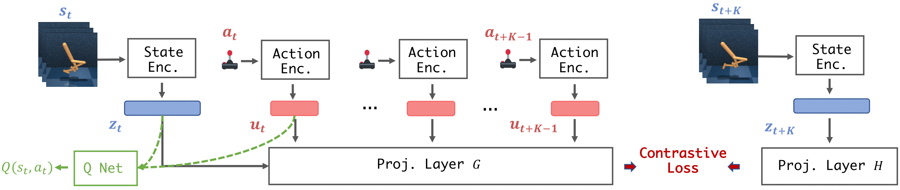

# TACO: Temporal Action-driven Contrastive Learning

Original PyTorch implementation of **TACO** from

[TACO: Temporal Latent Action-Driven Contrastive Loss for Visual Reinforcement Learning](https://arxiv.org/pdf/2306.13229.pdf) by

[Ruijie Zheng](https://ruijiezheng.com), [Xiyao Wang](https://si0wang.github.io)\*, [Yanchao Sun](https://ycsun2017.github.io)\*, [Shuang Ma](https://www.shuangma.me)\*, [Jieyu Zhao](https://jyzhao.net)\*, [Huazhe Xu](http://hxu.rocks)\*, [Hal Daumé III](http://users.umiacs.umd.edu/~hal/)\*, [Furong Huang](https://furong-huang.com)\*


<p align="center">
  <br><br>
   <a href="https://arxiv.org/pdf/2306.13229.pdf">[Paper]</a>&emsp;<a href="https://ruijiezheng.com/project/TACO/index.html">[Website]</a>
</p>


## Method

**TACO** is a simple yet powerful temporal contrastive learning approach that facilitates the concurrent acquisition of latent state and action representations for agents. **TACO** simultaneously learns a state and an action representation by optimizing the mutual information between representations of current states paired with action sequences and representations of the corresponding future states.

<p align="center">
  
</p>


## Citation

If you use our method or code in your research, please consider citing the paper as follows:

```
@inproceedings{
zheng2023taco,
title={\${\textbackslash}texttt\{{TACO}\}\$: Temporal Latent Action-Driven Contrastive Loss for Visual Reinforcement Learning},
author={Ruijie Zheng and Xiyao Wang and Yanchao Sun and Shuang Ma and Jieyu Zhao and Huazhe Xu and Hal Daumé III and Furong Huang},
booktitle={Thirty-seventh Conference on Neural Information Processing Systems},
year={2023},
url={https://openreview.net/forum?id=ezCsMOy1w9}
}

```

## Instructions

Assuming that you already have [MuJoCo](http://www.mujoco.org) installed, install dependencies using `conda`:

```
conda env create -f environment.yml
conda activate taco
```

After installing dependencies, you can train a **TACO** agent by calling (using quadruped_run as an example):

```
CUDA_VISIBLE_DEVICES=X python train.py agent=taco task=quadruped_run exp_name=${EXP_NAME} 
```

To train a **DrQ-v2** agent:
```
CUDA_VISIBLE_DEVICES=X python train.py agent=drqv2 task=quadruped_run exp_name=${EXP_NAME} 
```

Evaluation videos and model weights can be saved with arguments `save_video=True` and `save_model=True`. Refer to the `cfgs` directory for a full list of options and default hyperparameters.


## Acknowledgement
TACO is licensed under the MIT license. MuJoCo and DeepMind Control Suite are licensed under the Apache 2.0 license. We would like to thank DrQ-v2 authors for open-sourcing the [DrQv2](https://github.com/facebookresearch/drqv2) codebase. Our implementation builds on top of their repository.


